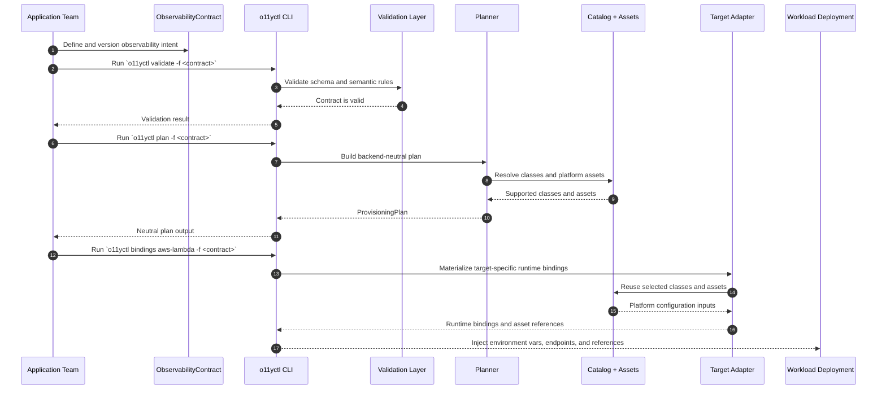

# workshop-iidp-o11y

Platform engineering product for contract-driven observability across multiple workloads, runtimes, and delivery targets.

This repository defines an application-facing observability contract, validates that contract, translates it into a backend-neutral plan, and produces target-specific bindings and platform asset references. The goal is to let application teams request observability capabilities without coupling themselves to a particular implementation backend.

## Product Scope

This repository provides:

- the `ObservabilityContract` model
- schema and semantic validation
- a backend-neutral planner
- target adapters
- reusable catalog classes
- reusable platform assets for collectors, dashboards, and alerts

## Current Product Interface

The current operational interface includes both CLI and HTTP:

- `o11yctl validate`
- `o11yctl plan`
- `o11yctl bindings aws-lambda`
- `o11yd` HTTP control plane
- root platform-managed suite workflows and Terraform module

Example commands:

```bash
go run ./cmd/o11yctl validate -f examples/contracts/aws-lambda-order-processing.yaml
go run ./cmd/o11yctl plan -f examples/contracts/aws-lambda-order-processing.yaml
go run ./cmd/o11yctl bindings aws-lambda -f examples/contracts/aws-lambda-order-processing.yaml --collector-endpoint http://collector.internal:4318
go run ./cmd/o11yd -listen :8080
```

## Documentation

- Product operating model: [docs/operating-model.md](docs/operating-model.md)
- Platform consumer flow: [docs/consumer-interaction-flow.md](docs/consumer-interaction-flow.md)
- Observability contract: [docs/observability-contract.md](docs/observability-contract.md)
- Contract authoring guide: [docs/contract-authoring-guide.md](docs/contract-authoring-guide.md)
- Control-plane API: [docs/control-plane-api.md](docs/control-plane-api.md)
- Managed suite deployment: [docs/managed-suite.md](docs/managed-suite.md)
- Support matrix: [docs/support-matrix.md](docs/support-matrix.md)
- Current gap list: [docs/gap-list.md](docs/gap-list.md)

## Repository Structure

```text
.
├── adapter
│   └── aws
├── assets
│   ├── alerts
│   ├── collector
│   └── dashboards
├── catalog
│   └── classes
├── cmd/o11yctl
├── cmd/o11yd
├── docs
├── examples
├── .github
├── internal
│   ├── api
│   ├── adapters
│   ├── planner
│   ├── platform
│   ├── server
│   └── validation
└── infra
```

## Product Flow

1. An application team authors an `ObservabilityContract`.
2. The platform validates the contract.
3. The planner produces a neutral `ProvisioningPlan`.
4. A target adapter resolves supported bindings, classes, and asset references.
5. The application deployment consumes the generated outputs.

### Sequence Diagram



## Supported Today

- contract validation
- backend-neutral planning
- AWS Lambda runtime bindings
- HTTP API for `validate`, `plan`, and `bindings aws-lambda`
- root Terraform module for a platform-managed Grafana, Alloy, Prometheus, Loki, and Tempo suite
- GitHub Actions workflows to apply or destroy the managed suite
- reusable collector, dashboard, and alert asset layers

## Current Product Limits

See [docs/support-matrix.md](docs/support-matrix.md) and [docs/gap-list.md](docs/gap-list.md) for the exact current support boundary and the next product gaps to close.
